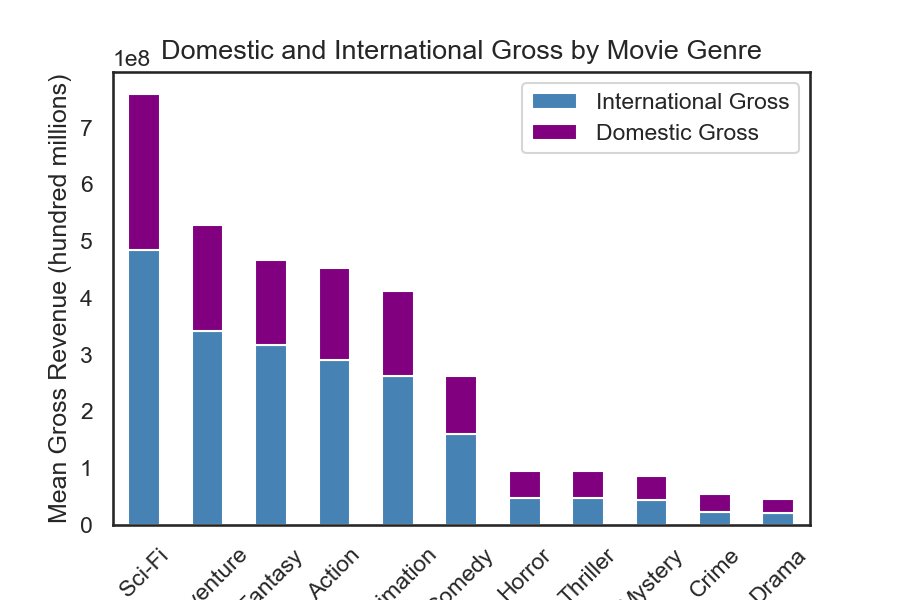
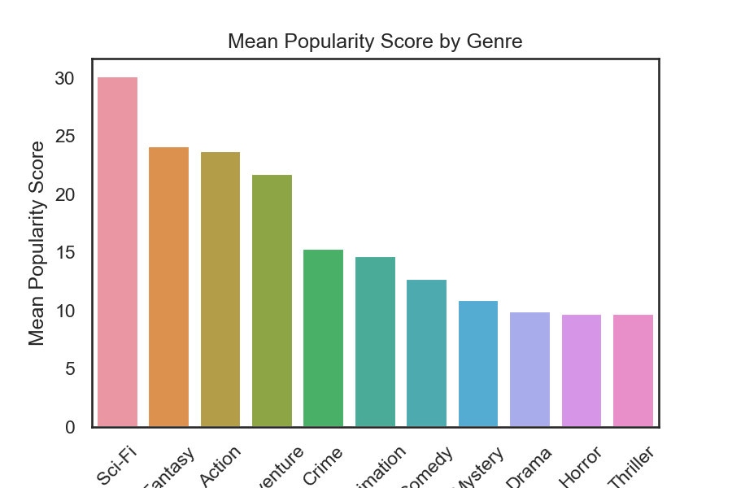
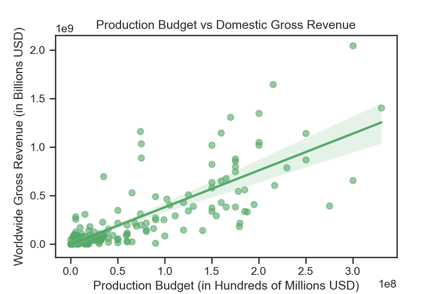

## Final Project Submission

Please fill out:
* Student names: Brian Reynolds, Timi, Elijah 
* Student pace: full time
* Scheduled project review date/time: January 28, 2022 @ 13:00 EST
* Instructor name: Angela Spratley
* Blog post URL: [Presentation URL](https://github.com/timiadejumo/phase1_group_project/blob/main/Phase%201%20Presentation%20-%20Elijah%2C%20Timi%2C%20Brian.pdf)

---

# Microsoft Film Studios
## A venture proposal

### Overview

This project analyzes the direction Microsoft should take when considering creating a film studio to enter into the cinema and movies market. Cursory analysis of film subjects show that movie genre and budget play a significant role in audience reception and gross revenue. Microsoft can use this analysis when considering movie subjects to proceed with and create actionable plans for movie development and growth in the film industry.

### Business Problem

Microsoft may be interested in expanding their financial portfolio into the film industry. When considering a large set of categories to enter in on, Microsoft may be able to make profit following popular genre trends. Using the [Internet Movie Database](https://www.imdb.com/) (IMDb), [The Numbers](https://www.the-numbers.com/) (TNDb), and [The Movie Database](https://www.themoviedb.org/) (TMDb) databases, we describe recent (2015-2019) film popularity trends and their gross revenues to better understand the business environment the new film studio will be entering.

### Data Understanding

IMDb, TNDb, and TMDb are data giants in the film industry, aggregating data from domestic and international film markets. These databases and files provide movie titles, release dates and years, production budgets, domestic and worldwide gross revenue, and inferential user statistics such as votes, ratings and popularity.

#### Mean Domestic and International Gross by Genre

    

#### Mean Popularity Score by Genre

The popularity score is a TMDb dynamic activity metric based off user activity on TMDb. It includes hits on page view, votes, and other user interactions by day compared with the previous days' activity. It's a complicated model, but it shows a better picture of audience interest than votes or ratings alone.

    

    

#### Regression of Worldwide Gross and Production Budget

After a look at the regression coefficients for different dataframe elements, we decided to create a regression line for the most prominent factor for worldwide gross revenue from the filtered `df1` dataframe. The production budget.

    

    

## Conclusions

This analysis suggests a few things about the current film industry:

* **Audiences are primarily interested in Sci-fi, Fantasy, Action, and Adventure films.** While other genres of films may do well fiscally, the popularity trends towards a specific set of genre and their combinations. This is likely do to the recent surge in superhero movies with Walt Disney's acquisition of Marvel in 2015.  

* **Sci-fi, Fantasy, Action, and Adventure films gross highest on average since 2015.** Entering into the film industry incurs a lot of up front costs. Microsoft should consider average gross and popularity when choosing a genre to enter on, rather then looking at net profit or return on investment which may lead to decisions that are unpopular with the target audience.   

* **High production budget means high gross revenue.** While some grossing movies do abnormally well or poor, there is a general trend for well funded movies to do well in the box office when considering both domestic and international markets.  

### Next Steps

Further analyses could yield additional insight into other industry details:

* **Popularity is a dynamic metric that needs to be followed.** The popularity of any genre may change frequently with audience decisions and interests. Using popularity data to guage and predict future interest of audiences can give Microsoft Film Studios an edge in this highly competitive industry. Focus groups may add to this insight.

* **Analysis of effective production crews and writers is needed.** Cast and crew are important parts of both popularity vote and the creative process behind film production.

* **Time of release may effect box office gross.** Analysis of seasonal or monthly releases may provide insight to audience behavior in the film industry. Competitor behavior may also play a role in box office gross with pending releases of competing titles.

